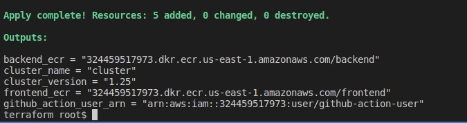

# CI/CD Workflows

All workflow files can be found in the `.github/workflows` directory.

## Frontend Workflow

### Trigger Conditions

- **CI:** On pull request events against `main`, or manually via the GitHub Actions UI.
- **CD:** On push events to `main`, or manually via the GitHub Actions UI.

Additionally, these workflows only run if there are changes in the `frontend` folder.

### Jobs

1. **Lint:** Uses `npm run lint` to check code quality.

2. **Test:** Uses `npm test` in CI mode (`CI=true npm test`).

3. **Build:**
   - Uses `docker build` to produce the Docker image (`mp-frontend`).
   - In the CD workflow, the image is tagged using the Git SHA (e.g., `:{{ github.sha }}`) and pushed to ECR.
   - The environment variable `REACT_APP_MOVIE_API_URL` is used in the Docker build args to point the frontend to the backend API.

4. **Deploy (CD only):** Deploys to the Kubernetes cluster via `kustomize` and `kubectl`.

## Backend Workflow

### Trigger Conditions

- **CI:** On pull request events against `main`, or manually via the GitHub Actions UI.
- **CD:** On push events to `main`, or manually via the GitHub Actions UI.

These workflows only run if there are changes in the `backend` folder.

### Jobs

1. **Lint:** Uses `pipenv run lint` to check code quality.

2. **Test:** Uses `pipenv run test` to run the Python tests.

3. **Build:** Uses `docker build` to produce the Docker image (`mp-backend`).

4. **Deploy (CD only):**
   - Tags the Docker image with the Git SHA (e.g., `:{{ github.sha }}`).
   - Pushes to ECR.
   - Updates the Kubernetes manifests with the new image tag using `kustomize` and runs `kubectl apply -f -`.

## Prerequisites

- **Docker:** To build container images (locally or via CI).
- **kubectl:** To manage Kubernetes deployments.
- **kustomize:** For handling the Kubernetes manifests dynamically.
- **AWS CLI:** To log in to ECR and manage EKS (if working locally).
- **Python 3.x, pipenv:** For running the backend locally.
- **Node.js, npm:** For running the frontend locally.

## Setup Instructions

### Local Setup (Optional)

If you’d like to run these apps locally (for development or testing):

#### Frontend

```bash
cd starter/frontend
nvm use  # or use actions/setup-node in GitHub
npm ci
npm run lint
CI=true npm test
npm start  # Launch local dev server on port 3000
```

By default, it expects the backend to be on `http://localhost:5000`.

#### Backend

```bash
cd starter/backend
pipenv install
pipenv run lint
pipenv run test
pipenv run serve
```

# AWS & EKS Setup

In this step, you will create Docker container repositories through Amazon Elastic Container Registry (ECR) and a Kubernetes environment in Amazon Elastic Kubernetes Service (EKS) to deploy the applications and verify the deployment step.

You may do this directly via the AWS console, or by using the provided Terraform configuration (found in `setup/terraform`).

## Option 1: Setting up via AWS Console

1. **Create two private ECR repositories:**
   - One for the frontend (`mp-frontend`).
   - One for the backend (`mp-backend`).

2. **Create an EKS cluster:**
   - To deploy the Docker images.

3. **Configure Kubernetes:**
   - Run `aws eks update-kubeconfig` to interact with your cluster locally.

## Option 2: Setting up via Terraform

### Step 1: Install `tfenv` and an appropriate version of Terraform

The workspace does not currently have an appropriate version of Terraform, so you'll need to run the following commands in your terminal to set up the correct version:

```bash
git clone https://github.com/tfutils/tfenv.git ~/.tfenv
export PATH="$HOME/.tfenv/bin:$PATH"
source ~/.bashrc
tfenv install 1.3.9
tfenv use 1.3.9
cd /workspace/setup/terraform
terraform init
```

<p align="center">
  
</p>

### Step 2: Create an administrator user in AWS

1. Go to the IAM console and create a new user.
2. Assign this user an **Administrator Role**.
3. Navigate to the new user's page, open its **Security credentials** tab, and click on **Create access key**.
4. Use this new user to apply the Terraform template in the next step.

### Step 3: Create AWS infrastructure with Terraform

1. Copy the access key and secret access key into the following environment variables in the workspace's shell:

   ```bash
   export AWS_ACCESS_KEY_ID={copied-access-key}
   export AWS_SECRET_ACCESS_KEY={copied-secret-key}
   ```

2. Use the commands below to run the Terraform setup and type `yes` after reviewing the expected changes:

   ```bash
   cd /workspace/setup/terraform
   terraform apply
   ```

3. When successful, you should see references to the created components in your terminal.

<p align="center">
  
</p>
   Take note of the Terraform outputs. You'll need these later as you work on the project. You can always retrieve these values later with this command:
   
   ```bash
   cd setup/terraform
   terraform output
   ```
## Troubleshooting IAM access error when applying a Terraform template

If you encounter issues, that look like the following:

<p align="center">
  
</p>
   
it may be because you ran `terraform apply` as a Udacity federated user account. Follow Step 3 above to create a new user and re-run `terraform apply` as the newly created user.

### Step 4: Generate AWS Access Keys for GitHub Actions

Generate AWS credentials for the IAM user account that GitHub Actions will use to interact with your AWS account:

1. Launch the Cloud Gateway and go to the IAM service.
2. Under users, locate the `github-action-user` account.
3. Click the account and navigate to **Security Credentials**.
4. Under **Access keys**, select **Create access key**.
5. Select **Application running outside AWS**, then click **Next** and **Create access key** to finish creating the keys.
6. On the last page, copy/paste these keys and store them in GitHub Secrets.

### Step 5: Add GitHub Action User to Kubernetes

## GitHub Secrets

Store the following secrets in your GitHub repository settings under **Settings → Secrets and variables → Actions**:

- `AWS_ACCESS_KEY_ID`
- `AWS_SECRET_ACCESS_KEY`
- `AWS_REGION` (e.g., `us-east-1`)
- `ECR_REPOSITORY_FRONTEND` (the ECR URL for your frontend repo)
- `ECR_REPOSITORY_BACKEND` (the ECR URL for your backend repo)
- `CLUSTER_NAME` (EKS cluster name)

These secrets are used by the GitHub Actions workflows to push images and deploy to EKS.

## Usage

- **Continuous Integration** triggers on pull requests targeting `main` (or manually).
- **Continuous Deployment** triggers on push to `main` (or manually).

When triggered, each workflow will:

1. Install dependencies (`npm` or `pipenv`)
2. Lint the code
3. Run tests
4. Build Docker images (only if lint/test pass)
5. Tag images with `{{ github.sha }}`
6. Push images to ECR
7. Update Kubernetes manifests via `kustomize` and apply them to the EKS cluster

Once deployed, the `mp-frontend` should display a list of movies from `mp-backend`.

### Step 5: Add GitHub Action User to Kubernetes

Add the `github-action-user` IAM user ARN to the Kubernetes configuration to allow that user to execute `kubectl` commands against the cluster. To do this, run the `init.sh` helper script in the setup folder:

```bash
cd setup
./init.sh
```

This script performs the following steps:

1. Fetches the ARN (Amazon Resource Name) for the `github-action-user` IAM user using the AWS CLI and stores it in a variable named `userarn`.
2. Downloads a specific version (v0.6.2) of the AWS IAM Authenticator for Kubernetes, makes it executable, and updates the IAM role/user permissions. It adds the IAM user to the Kubernetes cluster with the role or username `github-action-role` and assigns it to the `system:masters` group, granting full access to the cluster.
3. Cleans up by removing the downloaded AWS IAM Authenticator binary.

This operation needs to be performed only once. You can run this shell script directly in your terminal.
